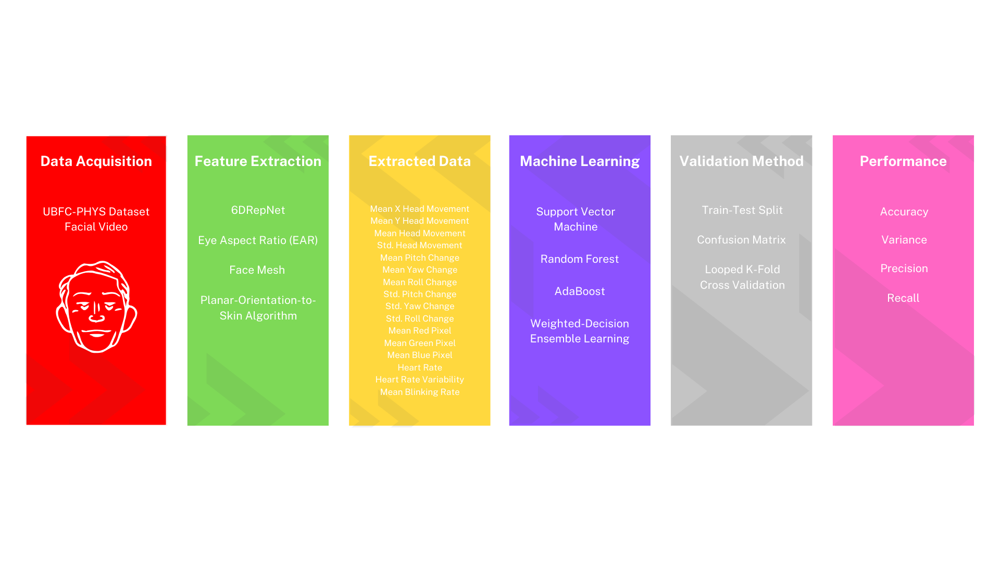

# Ensemble Based Anxiety Prediction from Facial Video
A final-year project predicting anxiety from facial video. This repository includes file for data extraction [video_HR.py], file of machine learning implementation using Weighted-Voting ensemble method [Model.py], and its implementation as an easy-to-use anxiety predictor completed with GUI [Final-Anxiety-Detection.py]. All of the steps to achieve this are listed in the provided graph below.

